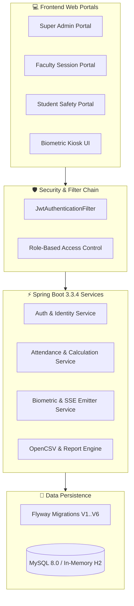

# 🎓 SmartAttend — Subject-Wise Attendance Management System

<div align="center">

# SmartAttend Academic ERP
### Designed for Bihar Engineering University (BEU), Patna — Session 2026–2030 (B.Tech 1st Semester Group-A)

[](file:///c:/Users/dilkh/OneDrive/Desktop/SAS/pom.xml)
[](file:///c:/Users/dilkh/OneDrive/Desktop/SAS/pom.xml)
[](file:///c:/Users/dilkh/OneDrive/Desktop/SAS/pom.xml)
[](file:///c:/Users/dilkh/OneDrive/Desktop/SAS/src/main/resources/application.yml)
[](http://localhost:8080/swagger-ui/index.html)
[](file:///c:/Users/dilkh/OneDrive/Desktop/SAS/README.md)

<p align="center">
  <b>⚡ Hardware-Ready Biometrics</b> • 
  <b>🔄 Live SSE Counters</b> • 
  <b>📐 BEU 75% Rule Engine</b> • 
  <b>📊 5-Mark Assessment Slabs</b> • 
  <b>🛡️ Spring Security 6 RBAC</b>
</p>

</div>

---

## 📚 Complete Project Documentation Suite

Our project is structured according to professional engineering standards with a dedicated `docs/` suite:

```
┌────────────────────────────────────────────────────────────────────────┐
│                      📖 SmartAttend Documentation                      │
├────────────────────────────┬───────────────────────────────────────────┤
│ 📋 [Product Requirements (PRD)](file:///c:/Users/dilkh/OneDrive/Desktop/SAS/docs/PRD.md)    │ Vision, Personas, User Stories & Metrics  │
│ 🏛️ [System Architecture](file:///c:/Users/dilkh/OneDrive/Desktop/SAS/docs/ARCHITECTURE.md)    │ Diagrams, Security Layer, SSE & ER Models │
│ 🎨 [UI/UX Design System](file:///c:/Users/dilkh/OneDrive/Desktop/SAS/docs/DESIGN.md)    │ Color Tokens, Typography & Component Specs│
│ 📜 [Engineering Rulebook](file:///c:/Users/dilkh/OneDrive/Desktop/SAS/docs/RULES.md)   │ Java 21, JS, Flyway & AI Coding Standards │
│ 📋 [Master Tasks Breakdown](file:///c:/Users/dilkh/OneDrive/Desktop/SAS/docs/TASKS.md) │ 10 Phases, 35 Tracked Milestone Tasks     │
│ 🏛️ [Architecture Decisions](file:///c:/Users/dilkh/OneDrive/Desktop/SAS/docs/DECISIONS.md) │ ADR-001 to ADR-010 Technical Rationale    │
│ 🧠 [Project Active Memory](file:///c:/Users/dilkh/OneDrive/Desktop/SAS/docs/MEMORY.md)  │ Active State, Credentials & Constraints   │
│ 🧪 [Comprehensive Test Plan](file:///c:/Users/dilkh/OneDrive/Desktop/SAS/docs/TEST_PLAN.md)│ Test Cases, Formulas & QA Checklists      │
│ 🛡️ [Security Architecture](file:///c:/Users/dilkh/OneDrive/Desktop/SAS/docs/SECURITY.md)  │ Threat Model, RBAC Matrix & Hardening     │
│ 🔌 [REST API Reference](file:///c:/Users/dilkh/OneDrive/Desktop/SAS/docs/API_DOCUMENTATION.md)     │ OpenAPI Spec, Payloads & Response Envelopes│
└────────────────────────────┴───────────────────────────────────────────┘
```

---

## 🚀 1. Overview & Highlights

**SmartAttend** is a full-stack, enterprise academic ERP engineered specifically for engineering colleges affiliated with **Bihar Engineering University (BEU), Patna**. 

### 🌟 Why SmartAttend is Different:
1. **Granular Subject-Wise Tracking:** Attendance is recorded per period (1 to 8) and course code, preventing general daily attendance from masking subject-specific shortages.
2. **BEU 75% Regulation & Shortage Math:** Automatically calculates exactly how many consecutive classes a student must attend to regain eligibility or how many they can safely miss.
3. **Official BEU 5-Mark Attendance Assessment Slab:** Real-time continuous internal mark computation (0 to 5 marks) based on university regulations.
4. **Live Biometric Stream (SSE):** Faculty projector displays real-time attendance counters updated over Server-Sent Events with zero page reloads.
5. **Zero-Setup Quickstart:** Boots automatically into an in-memory H2 database with pre-seeded BEU syllabus and 30 demo students if MySQL is not detected.

---

## 🏛️ 2. System Architecture



---

## 🔑 3. Default Demo Accounts

```
┌────────────────────────────────────────────────────────────────────────┐
│                        Default System Logins                           │
├─────────────┬────────────────┬──────────────┬──────────────────────────┤
│ Role        │ Username       │ Password     │ Access Portal            │
├─────────────┼────────────────┼──────────────┼──────────────────────────┤
│ Super Admin │ admin          │ Admin@123    │ /admin/index.html        │
│ Faculty     │ faculty        │ Faculty@123  │ /faculty/index.html      │
│ Student     │ student        │ Student@123  │ /student/index.html      │
└─────────────┴────────────────┴──────────────┴──────────────────────────┘
```

> *Pre-seeded with 30 demo students (`26105110001` through `26105110030`) enrolled in B.Tech 1st Semester CSE-A.*

---

## 📐 4. BEU Regulation & Calculation Rules

### 4.1. Shortage & Margin Formulas

- **Classes Needed to Reach 75% Minimum ($k$):**
  $$\text{Classes Needed } (k) = \max\left(0, \, \left\lceil \frac{0.75 \times \text{Total} - \text{Attended}}{0.25} \right\rceil\right)$$

- **Safe Bunks Margin ($m$):**
  $$\text{Margin } (m) = \max\left(0, \, \left\lfloor \frac{\text{Attended}}{0.75} - \text{Total} \right\rfloor\right)$$

### 4.2. Official BEU 5-Mark Attendance Slab

| Attendance Percentage Range | Internal Marks Awarded | Eligibility Status |
| :--- | :---: | :--- |
| **96.00% – 100.00%** | **5 / 5** | Eligible (Distinction) |
| **91.00% – 95.99%** | **4 / 5** | Eligible (Excellent) |
| **86.00% – 90.99%** | **3 / 5** | Eligible (Very Good) |
| **81.00% – 85.99%** | **2 / 5** | Eligible (Good) |
| **75.00% – 80.99%** | **1 / 5** | Eligible (Borderline) |
| **60.00% – 74.99%** | **0 / 5** | Medical Condonation Required |
| **Below 60.00%** | **0 / 5** | Strictly Debarred from University Exams |

---

## 💻 5. Quickstart & Installation

### Option 1: Fast Local Launch (Zero DB Setup - H2 In-Memory)

```bash
# Clone the repository
git clone https://github.com/Dilkhushkumardev/Student_Management_System.git
cd Student_Management_System

# Option A: Windows Batch Launcher
run.bat

# Option B: Maven CLI
mvn clean package -DskipTests
java -jar target/smart-attend-1.0.0.jar
```

Access the application in your browser:
👉 **Landing Page:** [`http://localhost:8080`](http://localhost:8080)  
👉 **Swagger UI:** [`http://localhost:8080/swagger-ui/index.html`](http://localhost:8080/swagger-ui/index.html)

---

### Option 2: Production Launch with Docker Compose (MySQL 8.0)

```bash
# Launch Spring Boot app and MySQL 8.0 containers
docker compose up --build -d

# View live application logs
docker compose logs -f smart-attend-app
```

---

## 🧪 6. Verification & Automated Testing

```bash
# Execute unit and integration tests
mvn test
```

All test suites verify:
- ✅ 75% attendance threshold & 15% medical condonation bounds
- ✅ Mathematical shortage ($k$) and safe bunk margin ($m$) calculations
- ✅ BEU 5-mark slab score mapping
- ✅ Biometric duplicate scan protection & session locking

---

## 📄 7. License

Developed for institutions affiliated with **Bihar Engineering University (BEU), Patna**.  
Released under the **MIT License**.
