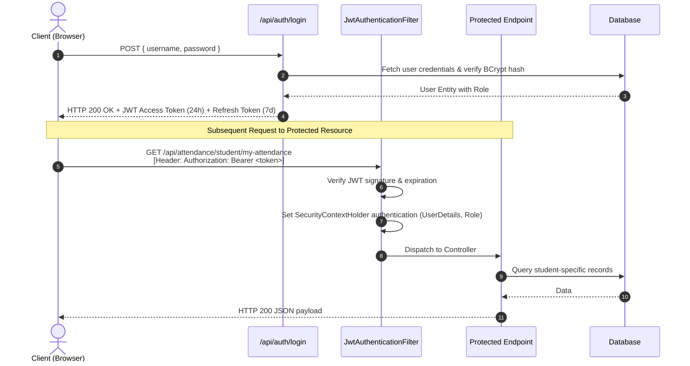
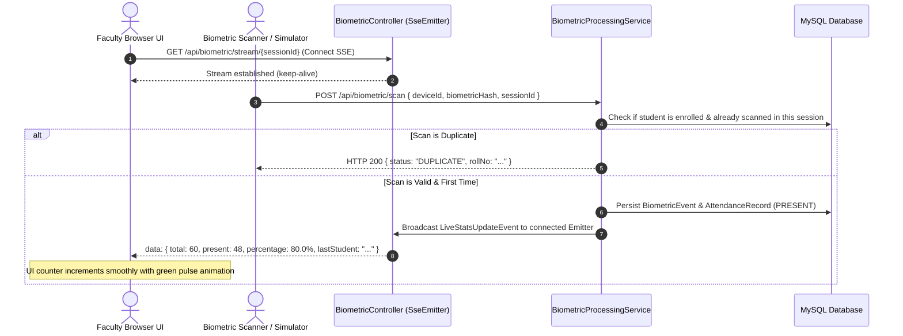
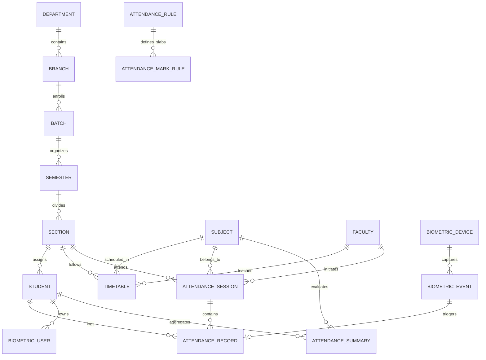

# 🏛️ System Architecture Document (ARCHITECTURE.md)

<div align="center">

# SmartAttend Architecture & Technical Design
### High-Performance, Modular Spring Boot & Real-Time Event-Driven Architecture

[](https://spring.io/projects/spring-boot)
[](https://openjdk.org/)
[](https://www.mysql.com/)
[](https://spring.io/projects/spring-security)

</div>

---

## 1. High-Level System Architecture

SmartAttend follows a clean, decoupled **Layered Client-Server Architecture** with asynchronous real-time event streaming for biometric check-ins and live class monitoring.

```mermaid
graph TB
    subgraph Client_Layer ["💻 Presentation Layer (Modern Web UI)"]
        A1[Super Admin Portal]
        A2[Faculty Session Dashboard]
        A3[Student Self-Service Portal]
        A4[Biometric Kiosk & Scanner UI]
    end

    subgraph Security_Layer ["🛡️ Security & Interception Layer"]
        B1[Spring Security 6 Filter Chain]
        B2[JwtAuthenticationFilter]
        B3[Stateless Token Validator / BCrypt]
        B4[Role-Based Authorization (RBAC)]
    end

    subgraph Controller_Layer ["⚡ REST API & SSE Gateway Layer"]
        C1[AuthController]
        C2[AttendanceController]
        C3[AcademicController]
        C4[BiometricController - SSE Emitter]
        C5[StudentController & FacultyController]
        C6[ReportController & NotificationController]
    end

    subgraph Service_Layer ["🧠 Business Logic & Rules Engine"]
        D1[AttendanceService & Calculator]
        D2[BEU 75% Regulation & 5-Mark Slab Engine]
        D3[BiometricProcessingService]
        D4[AcademicManagementService]
        D5[AuditLoggingService]
    end

    subgraph Hardware_Layer ["📟 Biometric Hardware Abstraction"]
        E1[FingerprintBiometricProvider]
        E2[FaceBiometricProvider]
        E3[RFIDBiometricProvider]
        E4[DemoSimulationProvider]
    end

    subgraph Persistence_Layer ["💾 Data Access & Storage Layer"]
        F1[Spring Data JPA Repositories]
        F2[Hibernate 6 ORM Layer]
        F3[Flyway Migration Engine V1..V6]
        F4[(MySQL 8.0 Primary DB)]
        F5[(H2 In-Memory Fallback DB)]
    end

    Client_Layer -->|HTTP/REST & SSE| Security_Layer
    Security_Layer --> Controller_Layer
    Controller_Layer --> Service_Layer
    Service_Layer --> Hardware_Layer
    Service_Layer --> Persistence_Layer
    Persistence_Layer --> F4
    Persistence_Layer --> F5
```

---

## 2. Component Design & Responsibilities

### 2.1. Presentation Layer (Frontend)
- **Zero-Dependency Modern Vanilla JS:** Pure ES6+ modular JavaScript with asynchronous `fetch` wrappers for API interactions.
- **Dynamic CSS & Design Tokens:** Bootstrap 5.3.3 enhanced with a proprietary Tech-ERP visual design system, glassmorphism, responsive grids, and dark/light mode CSS variables.
- **Live Event Receivers:** Native browser `EventSource` listening to `/api/biometric/stream/{sessionId}` to update live counters, percentages, and attendance badges without page reloads.
- **Visual Analytics:** Chart.js 4.4 integration for rendering subject-wise attendance doughnut meters and weekly trend lines.

---

### 2.2. Security & Authentication Architecture



---

### 2.3. Biometric Streaming & Live Counter Engine (SSE)

Real-time attendance in lecture halls operates via **Server-Sent Events (SSE)** for unidirectional, ultra-low-overhead event dispatching from server to faculty screens.



---

## 3. Database Architecture & ER Model

The data layer is managed via **Flyway Migrations (V1 to V6)** ensuring repeatable, version-controlled database schema across development, staging, and production environments.



### 3.1. Database Migration Breakdown

| Migration Version | Description | Target Functionality |
| :--- | :--- | :--- |
| `V1__initial_schema.sql` | Core DDL tables | Users, Roles, Academic Hierarchy, Sessions, Attendance, Biometrics |
| `V2__seed_roles.sql` | System RBAC Seeding | Inserts `ROLE_SUPER_ADMIN`, `ROLE_FACULTY`, `ROLE_STUDENT` |
| `V3__seed_academic_data.sql` | BEU Master Academic Data | University, College, Department (CSE), Branch, Batch (2026-30), Sem 1 |
| `V4__seed_subjects.sql` | BEU 1st Sem Syllabus | 7 Theory courses + 3 Practical laboratory courses with official codes |
| `V5__seed_demo_students.sql` | Student Body Seeding | 30 Demo B.Tech CSE students (`26105110001` - `26105110030`) |
| `V6__seed_attendance_rules.sql`| BEU Ordinance Rules | 75% attendance rule, 15% condonation, 5-mark assessment slabs |

---

## 4. Codebase Directory Structure

```
c:/Users/dilkh/OneDrive/Desktop/SAS/
├── .cursor/
│   └── rules/                  # AI coding standards & architectural boundary rules
│       ├── general.mdc         # General coding conventions
│       ├── backend.mdc         # Spring Boot & JPA guidelines
│       ├── frontend.mdc        # Vanilla JS & CSS design system standards
│       ├── security.mdc        # JWT, RBAC & OWASP security rules
│       └── testing.mdc         # Unit & Integration test specifications
├── docs/                       # Project Documentation Suite
│   ├── PRD.md                  # Product Requirements Document
│   ├── ARCHITECTURE.md         # System Architecture & Technical Design (This File)
│   ├── DESIGN.md               # UI/UX Design System & Color Palette
│   ├── RULES.md                # Development Rules & Coding Conventions
│   ├── TASKS.md                # Step-by-Step Task Breakdown & Roadmap
│   ├── DECISIONS.md            # Architecture Decision Records (ADRs)
│   ├── MEMORY.md               # Project State & Active Context
│   ├── TEST_PLAN.md            # Testing Plan, Edge Cases & Verification
│   ├── SECURITY.md             # Security Policies & Threat Model
│   └── API_DOCUMENTATION.md    # REST API & Endpoint Reference
├── src/
│   ├── main/
│   │   ├── java/com/smartattend/
│   │   │   ├── SmartAttendApplication.java
│   │   │   ├── biometric/      # Hardware abstraction providers & simulated scanners
│   │   │   ├── config/         # Security, CORS, OpenAPI, MVC, WebConfig
│   │   │   ├── controller/     # REST Endpoints (Auth, Academic, Attendance, etc.)
│   │   │   ├── dto/            # Request/Response Data Transfer Objects
│   │   │   ├── entity/         # JPA Domain Entities (25 normalized entities)
│   │   │   ├── enums/          # Enumerations (Roles, SessionStatus, Method, etc.)
│   │   │   ├── exception/      # Global Exception Handler & Domain Errors
│   │   │   ├── repository/     # Spring Data JPA Data Access Interfaces
│   │   │   ├── security/       # JWT Provider, Auth Filter, Custom UserDetails
│   │   │   └── service/        # Core Business Logic & Rule Evaluators
│   │   └── resources/
│   │       ├── db/migration/   # Flyway SQL Migration Scripts (V1..V6)
│   │       ├── static/         # Frontend Web Application
│   │       │   ├── admin/      # Super Admin Management SPA
│   │       │   ├── faculty/    # Faculty Lecture & Attendance Session Portal
│   │       │   ├── student/    # Student Dashboard & Safety Meter Portal
│   │       │   ├── biometric/  # Biometric Kiosk Simulation UI
│   │       │   ├── css/        # Custom Design System CSS
│   │       │   ├── js/         # Modular ES6 API Clients & UI Controllers
│   │       │   ├── index.html  # Modern Landing & Feature Showcase Page
│   │       │   └── login.html  # Role-Aware Secure Authentication Portal
│   │       ├── application.yml # Base Configuration
│   │       ├── application-h2.yml
│   │       └── application-mysql.yml
├── Dockerfile                  # Multi-stage container build
├── docker-compose.yml          # Production stack (App + MySQL 8.0)
├── pom.xml                     # Maven build descriptor
├── run.bat                     # Windows one-click launcher
└── README.md                   # Visual Project Readme
```

---

## 5. Architectural Invariants & Boundary Rules

1. **Service Layer Isolation:** Controllers MUST NOT perform direct database queries or instantiate repositories. All business rules, transactions, and calculations reside strictly in the `@Service` layer.
2. **Stateless Authentication:** No HTTP session state (`SessionCreationPolicy.STATELESS`) is stored in backend memory. All user identities are conveyed via cryptographically signed JWTs.
3. **No Direct Entity Mutation in UI:** Controllers MUST map database entities to dedicated DTOs before responding to clients to prevent over-posting and JSON recursion bugs.
4. **Idempotent Scan Invariant:** Biometric scanners may submit duplicate network packets without corrupting or double-incrementing attendance tallies.
5. **Database Agnosticism:** Spring Data JPA queries must remain compatible with both MySQL 8 and H2 database dialects.
