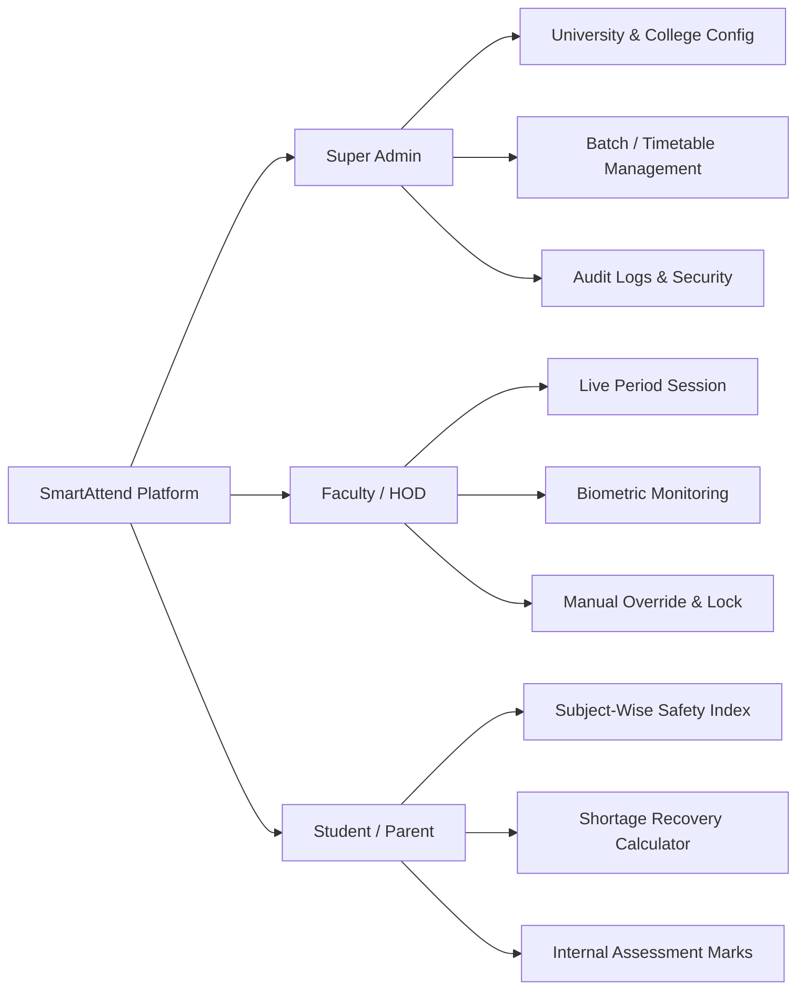

# 📋 Product Requirements Document (PRD)

<div align="center">

# SmartAttend — Subject-Wise Attendance & Academic ERP
### Bihar Engineering University (BEU), Patna — Session 2026–2030

[](file:///c:/Users/dilkh/OneDrive/Desktop/SAS/pom.xml)
[](file:///c:/Users/dilkh/OneDrive/Desktop/SAS/docs/MEMORY.md)
[](file:///c:/Users/dilkh/OneDrive/Desktop/SAS/docs/ARCHITECTURE.md)

</div>

---

## 1. Executive Summary & Vision

**SmartAttend** is an enterprise-grade academic attendance and student management platform engineered specifically for engineering institutions affiliated with **Bihar Engineering University (BEU), Patna**. 

Traditional attendance systems calculate aggregate attendance as a single flat percentage across a semester. This causes significant regulatory compliance issues because BEU Ordinance explicitly mandates **subject-wise attendance minimums (75%)** for both theory courses and practical laboratories independently. 

SmartAttend solves this by tracking attendance per class period with second-by-second biometric verification, live SSE event streaming, automated shortage/surplus mathematical calculators, and real-time computation of university internal assessment marks (5-mark attendance slab).

---

## 2. Problem Statement

Engineering colleges face multiple operational bottlenecks with legacy attendance tracking:

| Problem Domain | Legacy Workflow Failure | SmartAttend Solution |
| :--- | :--- | :--- |
| **Granularity** | Combined daily attendance obscures subject-specific bunking | Granular per-period (1–8) subject-wise logging |
| **Biometric Fraud & Speed** | Queues at door cause class delays; proxy check-ins occur | Multi-modal hardware + demo biometric engine with idempotency & live SSE validation |
| **BEU Regulation Compliance** | Manual calculation of 75% rule & 15% medical condonation | Instant mathematical shortage calculation & condonation tracking |
| **Internal Assessment Scoring** | Errors in calculating BEU 5-mark attendance slabs at semester end | Automated continuous calculation of 0 to 5 marks per subject |
| **Transparency & Disputes** | Students discover shortage only after exam admit cards are blocked | Real-time student portal with color-coded safety metrics & alerts |

---

## 3. Target Users & Personas



### 3.1. Primary Personas

#### 🧑‍💼 Super Administrator / Principal / Dean
- **Goals:** Oversee college-wide compliance, configure semesters/batches/sections, manage faculty assignments, enforce BEU lock-out criteria, and generate university submission reports.
- **Pain Points:** Discrepancies between faculty registers, late reporting, inability to audit altered records.

#### 👨‍🏫 Faculty Member / Course Instructor
- **Goals:** Initiate period sessions in 2 clicks, monitor biometric check-ins in real-time on projector/screen, mark manual absentees, lock sessions with cryptographic integrity.
- **Pain Points:** Wasting 15 minutes of every 50-minute lecture calling roll numbers manually.

#### 🎓 B.Tech Student (e.g. B.Tech CSE 1st Semester)
- **Goals:** Real-time visibility into attendance percentage per subject, knowing exactly how many classes can be safely missed or must be attended to stay above 75%.
- **Pain Points:** Sudden debarment from university examinations without prior actionable warnings.

---

## 4. Key Goals & Success Criteria

```
┌────────────────────────────────────────────────────────────────────────┐
│                          Core Product Goals                            │
├────────────────────────────────┬───────────────────────────────────────┤
│ 🎯 100% BEU Compliance        │ Zero calculation discrepancies        │
│ ⚡ < 200ms API Response Time    │ Ultra-low latency Spring Boot backend │
│ 🔄 Live Push Updates (SSE)     │ Real-time UI updates without reload   │
│ 🛡️ Strict RBAC Security        │ Role-isolated portals via Spring Sec 6│
│ 📊 Export Readiness           │ One-click BEU CSV/PDF export format   │
└────────────────────────────────┴───────────────────────────────────────┘
```

---

## 5. Detailed Feature Specifications

### 5.1. Academic Master Data Management
- **Hierarchical Structure:** University $\rightarrow$ College $\rightarrow$ Department $\rightarrow$ Branch $\rightarrow$ Batch $\rightarrow$ Semester $\rightarrow$ Section $\rightarrow$ Student.
- **Pre-configured Seed for BEU CSE (2026–2030):**
  - Theory: *Engineering Mathematics-I (`100102`)*, *Engineering Physics (`100104`)*, *Intro to AI (`100105`)*, *Computer Fundamentals (`100108`)*, *UHV (`100109`)*, *Constitution (`100110`)*, *BEEE (`100111`)*.
  - Practical: *Physics Lab (`100104P`)*, *BEEE Lab (`100111P`)*, *PPS Lab (`100112P`)*.

### 5.2. Period-Wise Attendance Session Engine
- **Session Lifecycle:** `SCHEDULED` $\rightarrow$ `IN_PROGRESS` $\rightarrow$ `COMPLETED` $\rightarrow$ `LOCKED`.
- **Session Attributes:** Session ID, Subject, Section, Faculty, Date, Period (1 to 8), Room No, Active Status.
- **Locking Mechanism:** Once locked by faculty or admin, records become immutable and can only be altered through an auditable Admin Override request.

### 5.3. Biometric Verification & Live Event Stream
- **Supported Modes:** `FINGERPRINT`, `FACE_RECOGNITION`, `RFID_CARD`, `DEMO_SIMULATOR`.
- **Idempotent Scan Processing:** Multiple scans within the same session return `DUPLICATE_SCAN` status and will not falsely increment attended counts.
- **Real-time SSE Dashboard:** Faculty screen receives real-time events (`PRESENT`, `LATE`, `DEVICE_HEARTBEAT`) via Server-Sent Events with visual avatar and sound cues.

### 5.4. BEU 75% Rule & Shortage Calculator

> [!IMPORTANT]
> BEU Ordinance mandates that a student must have minimum 75% attendance in each course independently to appear for university end-semester exams.

The system continuously calculates two mathematical indicators for every student in every subject:

#### Classes Needed to Attain 75% ($k$):
$$\text{Classes Needed } (k) = \max\left(0, \, \left\lceil \frac{0.75 \times \text{Total} - \text{Attended}}{0.25} \right\rceil\right)$$

#### Margin of Safe Bunks ($m$):
$$\text{Margin } (m) = \max\left(0, \, \left\lfloor \frac{\text{Attended}}{0.75} - \text{Total} \right\rfloor\right)$$

### 5.5. BEU 5-Mark Attendance Assessment Slab

Continuous grade calculation for internal marks according to official BEU criteria:

| Attendance Percentage Range | Internal Marks Awarded | Eligibility Status | Color Code |
| :--- | :---: | :--- | :--- |
| **96.00% – 100.00%** | **5 / 5** | Eligible (Distinction) | 🟢 Emerald (`#10B981`) |
| **91.00% – 95.99%** | **4 / 5** | Eligible (Excellent) | 🟢 Green (`#22C55E`) |
| **86.00% – 90.99%** | **3 / 5** | Eligible (Very Good) | 🔵 Blue (`#3B82F6`) |
| **81.00% – 85.99%** | **2 / 5** | Eligible (Good) | 🟡 Amber (`#F59E0B`) |
| **75.00% – 80.99%** | **1 / 5** | Eligible (Borderline) | 🟠 Orange (`#FB923C`) |
| **60.00% – 74.99%** | **0 / 5** | Medical Condonation Req. | 🔴 Rose (`#F43F5E`) |
| **Below 60.00%** | **0 / 5** | Strictly Debarred | 🔴 Crimson (`#EF4444`) |

---

## 6. MVP Scope vs Future Roadmap

### ✅ Included in MVP (Version 1.0.0 - Current)
- [x] Complete RBAC Auth (Admin, Faculty, Student) with JWT + Refresh Tokens.
- [x] BEU 2026–2030 B.Tech 1st Sem CSE Course Catalog & 30 Demo Students pre-seeded.
- [x] Period-based session creation with multi-status marking (Present, Absent, Late, Excused).
- [x] Biometric simulator + hardware integration stub with SSE live counters.
- [x] Mathematical shortage & bunk calculator.
- [x] BEU 5-mark assessment slab automated grading.
- [x] Student personalized portal with safety badges.
- [x] Faculty subject portal with bulk attendance entry.
- [x] Admin management portal with full audit logging.
- [x] Flyway automatic DB migrations (V1 to V6).
- [x] Dual environment support (Zero-setup H2 & Production MySQL 8.x).

### 🚀 Planned for Version 2.0.0 (Post-MVP)
- [ ] Push Notification system via WhatsApp / SMS Gateway for parent alerts when attendance drops below 75%.
- [ ] Mobile PWA offline sync for faculty in low-connectivity lecture halls.
- [ ] AI-based face recognition video feed via edge cameras.
- [ ] University-wide centralized multi-college cloud tenancy.

---

## 7. Non-Functional Requirements (NFR)

- **Performance:** 95% of API requests completed in under 150ms under a load of 500 concurrent students.
- **Availability:** 99.9% uptime during active academic hours (08:00 to 18:00 IST).
- **Security:** OWASP Top 10 compliance, BCrypt 12 rounds, stateless JWT, parameterized JPA queries preventing SQLi.
- **Browser Support:** Modern Chromium (Chrome/Edge 90+), Firefox 88+, Safari 14+, Mobile responsive (375px to 4K).
