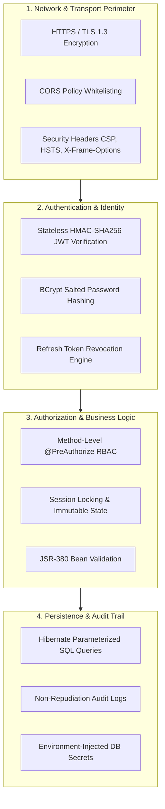

# 🛡️ Security Architecture & Policy (SECURITY.md)

<div align="center">

# SmartAttend Security & Hardening Guide
### Cryptographic Standards, RBAC Controls, OWASP Top 10 Protections & Auditability

[](file:///c:/Users/dilkh/OneDrive/Desktop/SAS/docs/RULES.md)
[](file:///c:/Users/dilkh/OneDrive/Desktop/SAS/pom.xml)
[](file:///c:/Users/dilkh/OneDrive/Desktop/SAS/docs/ARCHITECTURE.md)

</div>

---

## 1. Security Threat Model & Defense In Depth

SmartAttend employs a multi-layered **Defense-in-Depth** security strategy protecting sensitive academic records, biometric hashes, and administrative configurations.



---

## 2. Authentication & JWT Lifecycle Management

### 2.1. Cryptographic Specifications
- **Algorithm:** HMAC using SHA-256 (`HS256` / `Keys.hmacShaKeyFor(secretBytes)`).
- **Secret Key Entropy:** 256-bit minimum key length injected via `JWT_SECRET` environment variable.
- **Access Token Lifespan:** 24 hours (`86,400,000 ms`).
- **Refresh Token Lifespan:** 7 days (`604,800,000 ms`) with database tracking for revocation.

### 2.2. Token Verification Flow
Every inbound request to `/api/**` (except `/api/auth/**`, `/actuator/health`, and static assets) is intercepted by `JwtAuthenticationFilter`:
1. Extracts `Authorization: Bearer <token>` header.
2. Validates cryptographic signature against server secret.
3. Checks token expiration claims (`exp`).
4. Extracts username and granted authorities (`ROLE_SUPER_ADMIN`, `ROLE_FACULTY`, `ROLE_STUDENT`).
5. Populates Spring's `SecurityContextHolder`.

---

## 3. Role-Based Access Control (RBAC) Matrix

```
┌────────────────────────────────────────────────────────────────────────┐
│                        Role Permission Matrix                          │
├────────────────────────────┬─────────────┬───────────┬─────────────────┤
│ Capability                 │ SUPER_ADMIN │  FACULTY  │     STUDENT     │
├────────────────────────────┼─────────────┼───────────┼─────────────────┤
│ University / College Mgmt  │    ✅ Full   │  ❌ None  │     ❌ None     │
│ Department / Branch Config │    ✅ Full   │  ❌ None  │     ❌ None     │
│ Subject / Course Catalog   │    ✅ Full   │  👁️ Read  │     👁️ Read     │
│ Student Roster Management  │    ✅ Full   │  👁️ Read  │     ❌ None     │
│ Create Period Session      │    ✅ Full   │  ✅ Self  │     ❌ None     │
│ Biometric Live Monitor     │    ✅ Full   │  ✅ Self  │     ❌ None     │
│ Lock Session Records       │    ✅ Full   │  ✅ Self  │     ❌ None     │
│ Emergency Admin Override   │    ✅ Full   │  ❌ None  │     ❌ None     │
│ View Personal Attendance   │    ✅ Full   │  ❌ None  │     ✅ Self     │
│ View University Audit Logs │    ✅ Full   │  ❌ None  │     ❌ None     │
└────────────────────────────┴─────────────┴───────────┴─────────────────┘
```

---

## 4. OWASP Top 10 Mitigation Strategies

| Vulnerability (OWASP) | Risk in Academic ERP | SmartAttend Protection Mechanism |
| :--- | :--- | :--- |
| **A01: Broken Access Control** | Students viewing or editing peer attendance | Strict `@PreAuthorize("hasRole(...)")` and UserDetails isolation in Service layer |
| **A02: Cryptographic Failures** | Plaintext password leaks | BCrypt hashing with auto-generated salt and 12-round computational cost |
| **A03: Injection (SQLi / XSS)** | Malicious payloads in names/roll numbers | Spring Data JPA parameterized queries; strict JS `textContent` rendering |
| **A04: Insecure Design** | Retrospective attendance manipulation | Immutable session locking state with permanent audit trail in `audit_logs` |
| **A05: Security Misconfig** | Exposing stack traces in production | Global `@RestControllerAdvice` sanitizes error bodies into uniform `ApiResponse` |
| **A06: Vulnerable Components** | Outdated libraries with CVEs | Dependabot tracking; modern Spring Boot 3.3.4 and Java 21 LTS |
| **A07: Identification & Auth** | Brute force login attacks | Stateless JWT token verification; centralized credential evaluation |
| **A08: Software & Data Integrity**| Unverified DB changes | Flyway checksum validation on every startup across all SQL scripts |
| **A09: Logging & Monitoring** | Undetected administrative tampering | Every override event logs admin username, client IP, old value, new value, reason |
| **A10: SSRF** | Unauthorized internal network calls | No external URL fetching from client-controlled parameters |

---

## 5. Input Validation & Data Sanitization

All incoming API request payloads are validated via **JSR-380 Bean Validation** before hitting business logic:

```java
public record MarkAttendanceRequest(
    @NotNull(message = "Session ID is required")
    Long sessionId,

    @NotNull(message = "Student ID is required")
    Long studentId,

    @NotNull(message = "Attendance status is required")
    AttendanceStatus status,

    @NotNull(message = "Attendance method is required")
    AttendanceMethod method,

    @Size(max = 255, message = "Remarks cannot exceed 255 characters")
    String remarks
) {}
```

---

## 6. Pre-Deployment Security Checklist

- [ ] Ensure `JWT_SECRET` in `.env` is set to a cryptographically strong 64-character hex key.
- [ ] Ensure `SPRING_PROFILES_ACTIVE` is set to `mysql` in production containers.
- [ ] Verify database root credentials are NOT stored in public GitHub repositories.
- [ ] Ensure HTTPS / TLS is terminated at reverse proxy (Nginx / Cloudflare / Load Balancer).
- [ ] Run `mvn clean verify` to ensure all security test suites pass.
